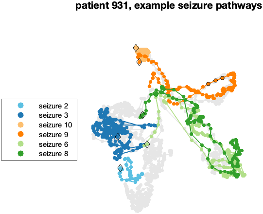
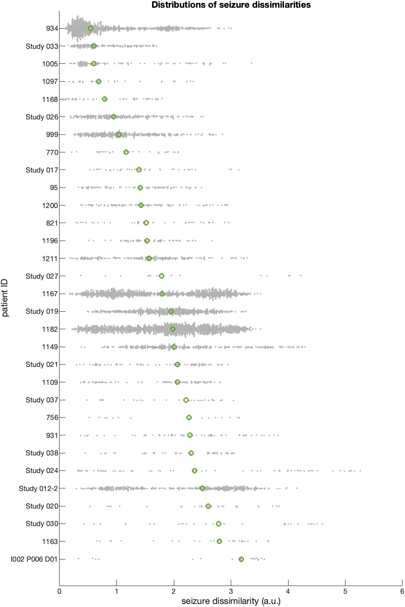
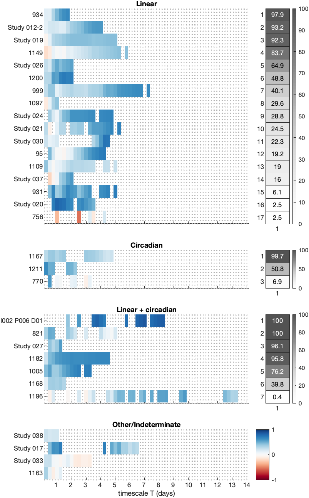

# schroeder2020_seizure_pathway
A full computational reproduction of the main figures and results from:

> Schroeder GM, Diehl B, Chowdhury FA, Duncan JS, de Tisi J, Trevelyan AJ, Forsyth R, Jackson A, Taylor PN, Wang Y. **Seizure pathways change on circadian and slower timescales in individual patients with focal epilepsy.** *PNAS* 2020;117(20):11048–11058. https://doi.org/10.1073/pnas.1922084117

Original code and data deposited by the authors on Zenodo: https://doi.org/10.5281/zenodo.3692923

---

## What the paper found

Epilepsy patients don't just have seizures at variable times — the seizures themselves look different from each other. This paper asks whether that variability is random or structured. Using intracranial EEG (iEEG) recordings from 31 patients with focal epilepsy (511 seizures total), the authors:

1. Represented each seizure as a trajectory through functional connectivity network space using NMF decomposition and MDS projection
2. Computed pairwise seizure dissimilarity using dynamic time warping
3. Showed that seizures closer together in time tend to be more similar (mean rho = 0.45, 21/31 patients significant after FDR correction)
4. Fit three mathematical models — linear drift, circadian oscillation, and linear + circadian — to classify each patient's temporal pattern

**Key finding:** Seizure pathway variability is not random. It tracks circadian and/or slower timescales in the majority of patients, suggesting that biological rhythms shape not just when seizures happen but how they unfold.

---

## Figures reproduced

### Figure 1B — Seizure pathways for patient 931
Six seizures highlighted in colour tracing routes through 2D network space. Seizures close in time take similar routes; distant seizures diverge.



### Figure 1C — Seizure dissimilarity matrix + temporal correlation (patient 931)
11×11 dissimilarity heatmap alongside the permutation test result showing rho = 0.69, p = 0.0001 for patient 931.


### Figure 2A — Seizure dissimilarity distributions across all 31 patients
Beeswarm plot of all pairwise dissimilarities per patient, coloured by clustering result (cyan = spectrum, purple = multiple clusters).



### Figure 3 — Temporal correlation across patients
Left: distribution of Spearman rho values across all patients (cyan = significant after FDR). Right: median dissimilarity at six timescales, separated by significance.


### Figure 4 — Model classification across all 31 patients
Patients classified into Linear (17), Circadian (3), Linear + Circadian (7), or Indeterminate (4) based on the shape of their temporal correlation pattern.



---

## How to reproduce

### Requirements
- MATLAB R2022a or later (tested on R2024a)
- No additional toolboxes required — see fixes below

### Steps

**1. Download the original Zenodo package**

Go to https://doi.org/10.5281/zenodo.3692923 and download `code_for_Seizure_pathways_change_in_individual_patients_v3.zip` (677 MB). Unzip to a folder called `seizure_pathways/`.

**2. Apply the fixes**

Copy `fixes/dtw_custom.m` from this repo into `seizure_pathways/lib/`.

In `seizure_pathways/lib/dtw_all_pairs.m`, find the line (around line 124):
```matlab
[dtw_dist(i,j),warp_i{i,j},warp_j{i,j}]=...
    dtw(data{i},data{j},opts.metric);
```
Change `dtw` to `dtw_custom`:
```matlab
[dtw_dist(i,j),warp_i{i,j},warp_j{i,j}]=...
    dtw_custom(data{i},data{j},opts.metric);
```

In `seizure_pathways/fig1_and_fig3_931_seizure_pathways.m`, replace both instances of:
```matlab
s=suptitle(...)
```
with:
```matlab
s=sgtitle(...)
```

In `seizure_pathways/fig3_temporal_association_across_patients.m`, replace:
```matlab
all_mat_perm_q = mafdr(all_mat_perm_p(:),'BHFDR',true);
all_mat_perm_q = reshape(all_mat_perm_q,n_subjects,n_mats);
```
with:
```matlab
p_vec = all_mat_perm_p(:);
n_tests = length(p_vec);
[p_sorted, sort_idx] = sort(p_vec);
bh_threshold = (1:n_tests)' * 0.05 / n_tests;
q_vec = zeros(n_tests,1);
for k = n_tests:-1:1
    if k == n_tests
        q_vec(sort_idx(k)) = p_sorted(k);
    else
        q_vec(sort_idx(k)) = min(p_sorted(k) * n_tests / k, q_vec(sort_idx(k+1)));
    end
end
all_mat_perm_q = reshape(q_vec, n_subjects, n_mats);
clearvars p_vec n_tests p_sorted sort_idx bh_threshold q_vec k
```

In `seizure_pathways/fig4_model_results_across_patients.m`, replace:
```matlab
colorbar('Location','southoutside')
```
with:
```matlab
h.ColorbarVisible = 'on';
```

**3. Set save_pdf = false in all scripts**

Each script has a `save_pdf = true` line near the top. Change all of them to `save_pdf = false` unless you have Ghostscript installed.

**4. Run the scripts**

Open MATLAB, `cd` into `seizure_pathways/`, then run in order:

```matlab
directories_setup
addpath(genpath('lib/'))
addpath(genpath('lib/external_toolboxes'))

run('fig1_and_fig3_931_seizure_pathways.m')   % Figures 1 + 3A-B — ~5 min (MDS + DTW)
run('fig2_dissimilarity_distributions_and_clusters.m')  % Figure 2 — fast
run('fig3_temporal_association_across_patients.m')      % Figure 3C-D — fast
run('fig4_patient_931_model.m')                         % Figure 4A-B — fast
run('fig4_model_results_across_patients.m')             % Figure 4C — fast
```

---

## Fixes applied

Three compatibility issues were encountered running the original code on MATLAB R2024a:

| Issue | Cause | Fix |
|---|---|---|
| `dtw` not found | Signal Processing Toolbox not installed despite valid license | Replaced with `dtw_custom.m` — a self-contained DTW implementation |
| `mafdr` not found | Bioinformatics Toolbox not installed | Replaced with manual Benjamini-Hochberg FDR correction (~10 lines) |
| `suptitle` not found | Removed in MATLAB R2022a | Replaced with `sgtitle` (direct drop-in replacement) |
| `colorbar('Location',...)` error with heatmap | API change in newer MATLAB | Replaced with `h.ColorbarVisible = 'on'` |

The custom DTW implementation (`dtw_custom.m`) reproduces the L1 distance dynamic time warping used in the original code with no restrictions on warp path length, matching the paper's `opts.maxsamp = []` setting.

---

## Environment

- MATLAB R2024a (24.1.0.2653294) Update 5
- macOS 26.3.1
- No Signal Processing Toolbox
- No Bioinformatics Toolbox

---

## Citation

If you use this reproduction in your own work, please cite the original paper:

```
Schroeder GM, Diehl B, Chowdhury FA, Duncan JS, de Tisi J, Trevelyan AJ,
Forsyth R, Jackson A, Taylor PN, Wang Y. Seizure pathways change on circadian
and slower timescales in individual patients with focal epilepsy.
PNAS. 2020;117(20):11048-11058. doi:10.1073/pnas.1922084117
```

And the original code deposit:

```
Schroeder GM et al. Supplementary code and visualisations for "Seizure pathways
change on circadian and slower timescales in individual patients with focal epilepsy."
Zenodo. 2020. doi:10.5281/zenodo.3692923
```
